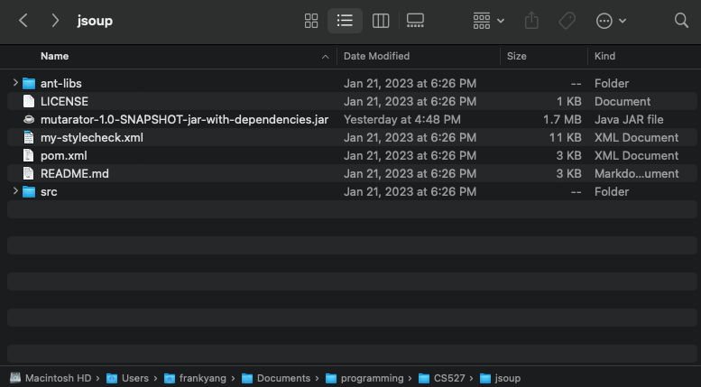

# Compile Executable

In the root of Mutarator project

    mvn clean compile assembly:single

This will produce an executable in **target** folder.

# Run Mutarator on Custom Project

Move the previously generated executable into the root of the custom project.  
It would look like the following picture:

    

Execute the following command with desired kinds of mutators

    java -cp mutarator-1.0-SNAPSHOT-jar-with-dependencies.jar edu.illinois.mutarator.Main <Mutator Tag>

# Mutator Tags

| Mutator Name | Tag |
|--------| ----|
|Arithmetic Operator Deletion | AOD |
|Arithmetic Operator Replacement | AOR|
|Bitwise Operator Replacement | BO |
|Conditionals Boundary | CB|
|Math | Math|
|Negate Conditionals | NC |
| Relational Operator Replacement | ROR |
|Argument Propagation | AP |
|Member Variable | MV |
|Naked Receiver | NR |
| Empty Return | ER |
|False Return |FR |
|Null Return | Null |
|Primitive Return | PR |
|True Return | TR |
| Increment | Increment |
|Invert Negatives | IN |
|Unary Operation Insertion | UOI |
|Constant Replacement |CR |
|Switch Block Mutation | Switch |
